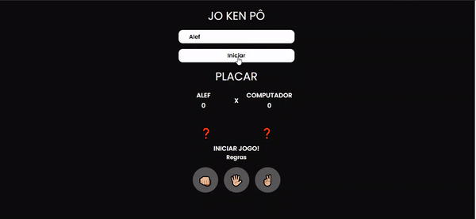

# Jo-Ken-Po

<b>Este projeto foi iniciado com:</b>

  

 

<b>As tecnologias utilizadas foram:</b>

 

 

<h2>Regras do Jogo!</h2>

Jo ken pô, é um jogo em que as pessoas jogam com as mãos, escolhendo entre pedra (mão fechada), papel (mão espalmada) e tesoura (dois dedos a frente). O jogo é similar ao 'par ou ímpar', porém com uma variável a mais. E funciona assim: cada jogador escolhe uma opção. A tesoura corta o papel, mas quebra com a pedra; o papel embrulha a pedra, mas é cortado pela tesoura e a pedra quebra a tesoura e é embrulhada pelo papel.

<h2>Jogo Funcionando!</h2>  

<h3>
Acesse o jogo <a href="https://nimble-pastelito-ab9a68.netlify.app/" target="_blank">Aqui.</a>

Projeto Criado por:
<a href="https://www.linkedin.com/in/pedroh-dev/" target="_blank">Pedro Dev</a>
 
Desenvolvido por:
<a href="https://www.linkedin.com/in/alef-reis202/" target="_blank">Alef Reis</a>
</h3>

